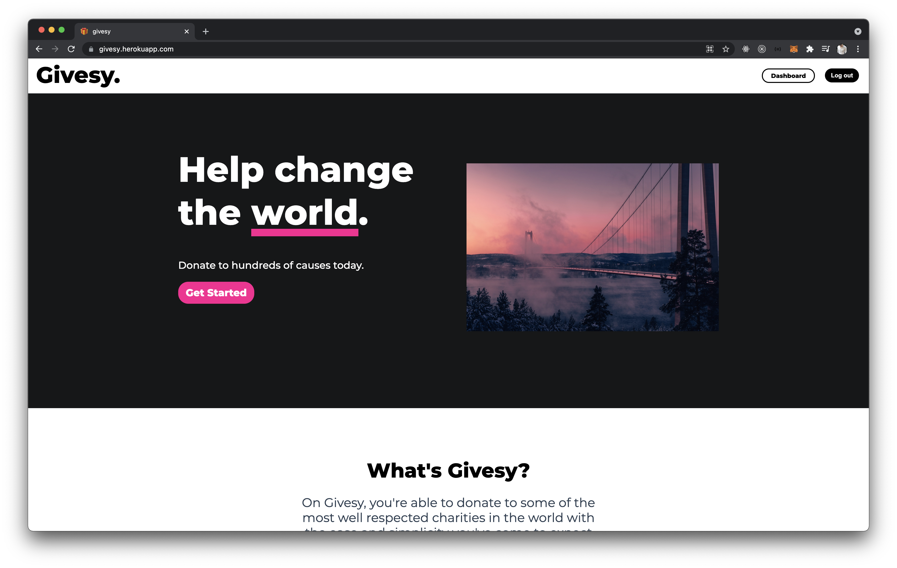

# Givesy

A new way to find charities and donate - inspired by Patreon.\
Please visit the site [here](https://givesy.herokuapp.com/)!



## Quick start

You will need to have a [Stripe API](https://stripe.com/docs/api) key and [Firebase](https://firebase.google.com/) account ready.

```
npm install
cp .env.example .env
npm run client:dev
npm run server:dev
```

## Technologies used

[Vue](https://vuejs.org/)\
[Axios](https://axios-http.com/docs/intro)\
[Firebase](https://firebase.google.com/)\
[Knex](https://knexjs.org/)\
[Material-UI](https://material-ui.com/)\
[Moment.js](https://momentjs.com/)\
[PostgreSQL](https://www.postgresql.org/)\
[Stripe API](https://stripe.com/docs/api)
